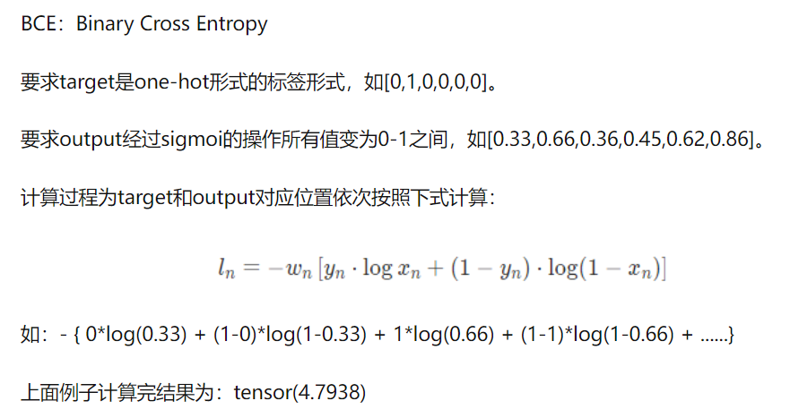

## [Total Code](Logistic.py):

``` python
import torch.nn.functional as F
import torch

x_data = torch.tensor([[1.0], [2.0], [3.0]])
y_data = torch.tensor([[0.0], [0.0], [1.0]])


class LogisticRegressionModel(torch.nn.Module):
    def __init___(self):
        super(LogisticRegressionModel, self).__init__()
        self.linear = torch.nn.Linear(1, 1)

    def forward(self, x):
        y_pred = F.sigmoid(self.linear(x))
        return y_pred


model = LogisticRegressionModel()

criterion = torch.nn.BCELoss(size_average=False)
optimizer = torch.optim.SGD(model.parameters(), lr=0.01)

for epoch in range(1, 101):
    y_pred = model(x_data)
    loss = criterion(y_pred, y_data)
    print("Epoch:", epoch, "loss=", loss.item())
    optimizer.zero_grad()
    loss.backward()
    optimizer.step()  # update parameters
```

### 1. Prepare Dataset
``` python
x_data = torch.tensor([[1.0], [2.0], [3.0]])
y_data = torch.tensor([[0.0], [0.0], [1.0]])
```
__We create two tensor subejects.__
### 2. Design Model
``` python
class LogisticRegressionModel(torch.nn.Module):
    def __init___(self):
        super(LogisticRegressionModel, self).__init__()
        self.linear = torch.nn.Linear(1, 1)

    def forward(self, x):
        y_pred = F.sigmoid(self.linear(x))
        return y_pred


model = LogisticRegressionModel()
```

>___y_pred = F.sigmoid(self,self.linear(x))___
>>__We use sigmoid to solve binary classification.__ 
### 3. Construct loss and optimizer
``` python

criterion = torch.nn.BCELoss(size_average=False)
optimizer = torch.optim.SGD(model.parameters(), lr=0.01)
```
#### BCELoss:

### 4. Training Cycle
``` python
for epoch in range(1, 101):
    y_pred = model(x_data)  # predict data
    loss = criterion(y_pred, y_data)    # get loss  
    print("Epoch:", epoch, "loss=", loss.item())    
    optimizer.zero_grad()   # initilize
    loss.backward()      # backward progression
    optimizer.step()  # update parameters
```